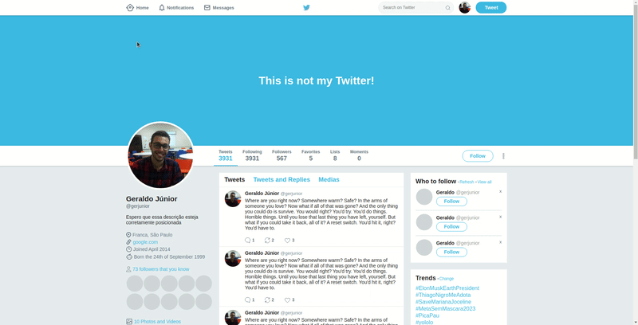

# twitter-ui-clone

Just a simple clone of the old twitter UI (that I like more than the new one).
Since this is my first UI clone, I followed a webpage design tutorial provided by a Rocketseat Bonus in the React Ignite course.

Important concepts I learning by doing this:

- the box model
- flexbox (direction, wrapping, individual alignment, etc.)
- creating variables
- the !important flag
- transition, filter, brightness of colors
- position relative, absolute
- border-radius
- negative margin alignment

I gave a lot of attention to color transitioning.

